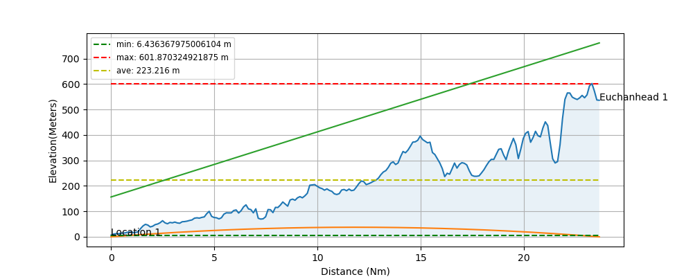

## Overview
This application allows the user to batch process multiple line of sight queries and output them in graphical form,
using data from the Google Elevation API.  A .kml file is also produced for viewing in Google Earth.

## Installation

### Cloning
```git clone https://github.com/MHenderson1988/line-of-sight-analysis.git```

Run gui.py and follow the on-screen instructions. 

### Before you start
To run the application, in it's current form, you will require - 
* A valid 'Google Elevation API' key
* 2x Valid .csv files

### Valid CRS (Coordinate reference systems)
Currently the application can convert between the following -
 
* Decimal latitude/longitude\
* Eastings and Northings\
* British national grid (OSBG36)

### Example .csv file


The above example uses decimal latitude/longitude.  

Row 1 - Latitude (Float)\
Row 2 - Longitude (Float)\
Row 3 - Height, in metres (int/float)\
Row 4 - Unique name (String)

Note - if using OSBG36, the .csv file should only use 3 rows.  The grid reference, the height and the unique name.

### Example output

Graphical output will look like this - 



The green line shows the path taken between the top point of the first and second locations.  Below is the imposed
elevation data which has been manipulated to the simulated curvature of the earth (shown by the orange arc).  

## Current limitations
Currently the application has the following limitations - 

* Earth curvature is calculated, assuming that the Earth is a perfect sphere
* Only Google Elevation API is currently supported
* Only natural terrain is accounted for.  This application does not take foliage or man-made objects/buildings into account

## Required
numpy~=1.18.5\
PySimpleGUI~=4.20.0\
matplotlib~=3.2.1\
simplekml~=1.3.5\
OSGridConverter~=0.1.3\
pyproj~=2.6.1.post1\
haversine~=2.2.0\
mock~=4.0.2\
requests~=2.24.0